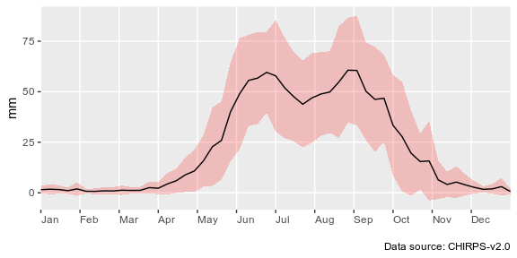
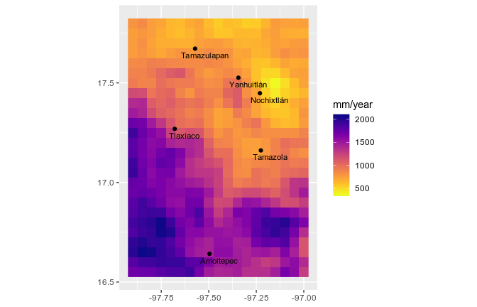
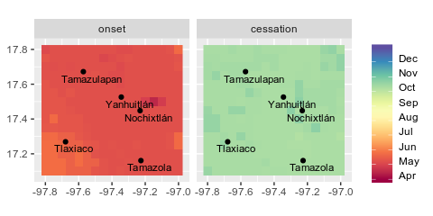
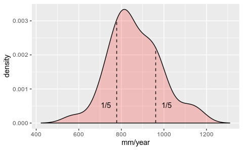
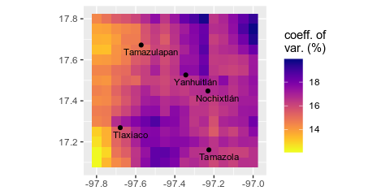
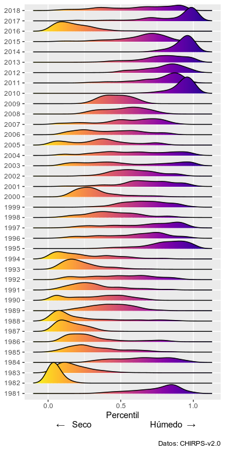
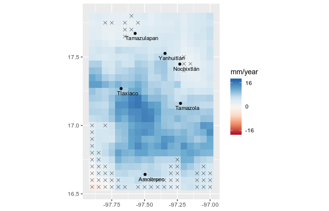
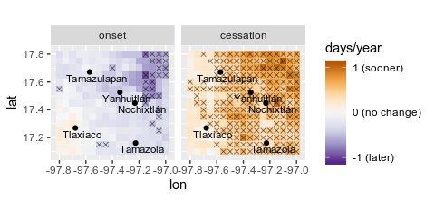
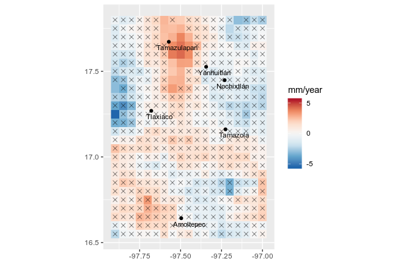

Caracterización del régimen pluvial de la Mixteca Alta, Oaxaca, y sus cambios (1981 - 2018)
================
Carlos Dobler -
September 4, 2019

El presente reporte documenta los patrones de precipitación de la Mixteca Alta y sus cambios durante los últimos 38 años. Para su elaboración, se analizó la base de datos de precipitación en malla CHIRPS version 2.0 (Funk et al., 2015). Combinando imágenes infrarrojo de nubes y datos de estaciones meteorológicas, CHIRPS (*Climate Hazards group Infrared Precipitation with Stations*) estima la cantidad de precipitación recibida a nivel diario, globalmente, con una resolución espacial de 0.05° (~5 km). Dadas estas características, CHIRPS tiene el potencial de proveer información detallada en regiones con una pobre cobertura espacial y temporal de datos climáticos. Tal es el caso de la Mixteca Alta. Con una extensión de ??? km2, la región cuenta con tan solo 4 estaciones, todas con vacíos del orden de décadas (obtenido del documento que preparó Quetzal).

Con este reporte buscamos solventar estas carencias, proporcionando una caracterización continua en tiempo y espacio de la lluvia en la Mixteca Alta. Nos enfocamos en analizar tres aspectos principales de los patrones de precipitación de la región: su magnitud (cantidad), su estacionalidad, y su variabilidad interananual. En la primera sección se presenta la climatología de la región, o el comportamiento promedio de la lluvia desde 1981 hasta el 2018. En la segunda sección se reporta un análisis de tendencias durante el mismo periodo cuyo fin fue detectar si ha habido cambios en dichos patrones y dónde.

## 1. Climatología pluvial de la Mixteca Alta

La Mixteca Alta recibe en promedio 1182 mm de lluvia anuales. La distribución de la precipitación a lo largo del año es marcadamente estacional (Fig. 1). La estación lluviosa, la cual de manera general inicia en mayo y concluye en octubre, concentra el 87% de la precipitación anual. Dentro de la estación lluviosa se observa un patrón de distribución bimodal, con máximos a mediados de junio y finales de agosto. Entre los máximos, la precipitación presenta una disminución relativa, o canícula, manifestándose de manera más acentuada a finales de julio.

Fig. 1. Distribución temporal de la precipitación (mm/semana).

Con respecto a su distribución espacial, los patrones de precipitación se podrían dividir en dos zonas (Fig. 2). Mientras los valles del noreste son más secos, con acumulaciones de entre 500 y 800 mm al año, la serranía del suroeste es mucho más húmeda, recibiendo entre 1,500 y 2,000 mm al año. \[sombra orográfica?\]

Fig. 2. Distribución espacial de la precipitación media anual.

La zona noreste también se distingue de la suroeste en términos de la llegada de la temporada lluviosa (Fig. 3). Mientras para el noreste ésta inicia a principios de mayo, en el suroeste inicia hacia finales del mismo mes. Esta diferencia en fechas no se manifiesta en el final de la temporada lluviosa, ocurriendo de manera generalizada a mediados de octubre para toda la región. Esto sugiere que existe una ligera diferencia regional en la duración de la temporada lluviosa: en el noreste es más larga, aproximadamente por un mes.

Fig. 3. Distribución espacial del inicio y término de la temporada lluviosa.

Si bien la precipitación media anual de la Mixteca Alta es de 1182 mm, el análisis de su variabilidad interanual indica que uno de cada cinco años, la precipitación disminuye por debajo de 1055 mm (una reducción de por lo menos 127 mm con respecto a la media) (Fig. 4). Nótese que estos eventos bien pueden ocurrir de manera consecutiva. Por otro lado, uno de cada cinco años, la precipitación excede 1296 mm (un aumento de por lo menos 114 mm con respecto a la media), pudiendo también ocurrir de manera consecutiva.

Fig. 4. Frecuencia de la precipitación media anual.

En su dimensión espacial, la variabilidad interanual también sigue un patrón diferenciado entre el noreste y suroeste de la región (Fig. 5). El suroeste tiende a ser más estable, con coeficientes de variación del 12 al 15%. El noreste, por el otro lado, es ligeramente más volátil, con coeficientes de variación que van del 15 al 18%.

Fig. 5. Distribución espacial de la variabilidad interanual de la precipitación.

## 2. Tendencias

En la figura 6 se presentan las anomalías pluviales por año con respecto al comportamiento promedio. Se puede observar que en los primeros años del periodo de estudio (i.e. de 1981 a 1994), la Mixteca estuvo bajo condiciones más secas de lo normal. Por el contrario, los últimos años acumularon más lluvia de lo normal (i.e. del 2010 al 2018), con excepción del 2016. Ese año, junto con 1982 y 1988, corresponden a los años más secos dentro del periodo de estudio. Los años 2010, 2014, y 2017 representan los años más húmedos.

Fig. 6. Anomalías en la precipitación anual. El área bajo la curva corresponde a la extensión total de la zona de estudio. Distribuciones hacia percentiles por debajo de 0.5 indican condiciones más secas de lo normal, mientras aquellas por arriba de 0.5 indican acumulaciones excedentes.

El análisis de cambios en la cantidad de lluvia indica que ésta ha ido en aumento durante los últimos 38 años para una extensión considerable de la Mixteca Alta (Fig. 7). Las áreas que exhiben un mayor aumento se ubican en la zona de transición entre los valles del noreste y las serranías del suroeste, con hasta 16 mm adicionales cada año (un incremento total de 608 mm desde 1981). Hacia el extremo noreste y suroeste no se pudo encontrar tendencia alguna.

Fig. 7. Cambios en la cantidad de precipitación anual. Celdas marcadas con "X" indican tendencias no significativas.

Con respecto a la estacionalidad, nuestro análisis indica que para la porción noreste, la temporada lluviosa ha estado llegando gradualmente más tarde (en promedio, poco menos de 1 día mas tarde cada año, lo que significa un cambio de alrededor de 20 días a lo largo de los últimos 38 años) (Fig. 8). El término de la temporada lluviosa para la zona noreste también exhibe una tendencia, en este caso hacia su ocurrencia más temprana. Sin embargo, estas tendencias no parecen significativas. Para el resto de la Mixteca Alta no se detectó ningún cambio considerable en el inicio y término de la temporada lluviosa.

Fig. 8. Cambios en las fechas de inicio y fin de la temporada lluviosa. Celdas marcadas con "X" indican tendencias no significativas.

Por último, en cuanto a cambios en la variabilidad interanual, nuestro análisis muestra un ligero aumento en la porción centro-norte, así como una franja en la porción central y en el suroeste (Fig. 9). Sin emargo, en estas últimas, las tendencias observadas no parecen significativas. Diminución en la variabilidad interanual se observa en el centro-occidente y ligeramente en el centro-oriente. De igual manera, estas tendencias no son significativas según nuestro análisis.

Fig. 9. Cambios en variabilidad interanual. Celdas marcadas con "X" indican tendencias no significativas.

